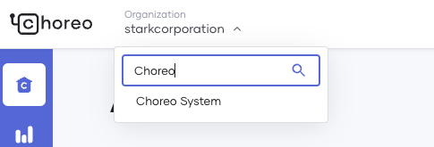

# Organization

An organization in Choreo is a logical grouping of users and users' resources. A first-time user can create an organization and be a member of it when signing in to Choreo. Users or resources in one organization cannot access another organization's resources unless an admin of this other organization invites them and adds them as a member of that organization. A user cannot create more than one organization.

## Switch organizations

If you are a member of more than one organization, you can switch from one organization to another. To do this, select the required organization from the **Organization** list in the header bar.

{.cInlineImage-small}

## Inviting members

The organization admin can invite members by assigning them roles in the organization. The invited members receive the invitation as an email notification. By accepting the invitation, the members add themselves to the organization. They are then able to access the resources of that organization.

## Roles

Choreo roles are defined as follows:

- **API Publisher**: An API publisher can discover, create, publish, delete, test, and manage an API.

- **API Subscriber**:  An API subscriber is a developer in a particular organization. An API subscriber can subscribe to an application, manage subscriptions, manage applications, generate API keys, and manage API keys.

- **Admin**: An admin is responsible for all administration tasks, including IdP creation, user management, customizing the Developer Portal, managing projects, enabling analytics, managing domains, etc.

- **Billing Admin**:  Is responsible for billing administration that includes viewing tiers, creating and viewing organizations, managing invoices, viewing and creating subscriptions, and viewing and creating payment methods. 

- **Developer**: A user with a developer role focuses on developing components and solutions in Choreo. Developers can create, build, test, and manage any component type in Choreo: API, services, triggers, scheduled jobs, and Webhooks. 

- **Env Manager**: Manages deployment environments. 

- **External API Subscriber**: External API subscribers are API consumers who have access only to the API Developer Portal. They join an organization with the sole purpose of consuming APIs. 

## Theme preference

An Admin can customize the developer portal via **Theme Preference**. You can customize the logos,  the color palette, the typography, and the footer links. 