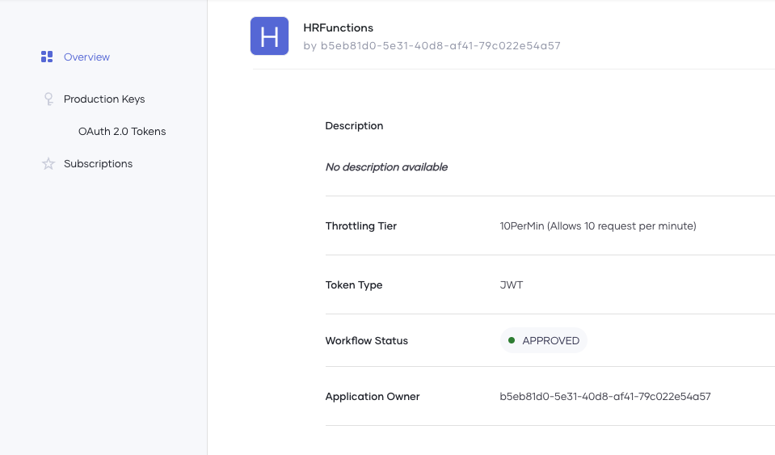

# Developer Portal

Application Programming Interfaces (APIs) are designed and built by API developers to make them available for repeated consumption for API consumers. The Choreo developer portal makes it easier for consumers to find and connect to thousands of APIs. Typically, an application developer who may be internal or external to your organization would want to consume the APIs published on the developer portal to develop software. The developer portal makes it easy for consumers to find, consume APIs, and manage subscriptions to these APIs. 

{.cInlineImage-threeQuarter}

## Consume API

API Consumption is the process of discovering the API, subscribing to the API, generating the necessary keys, and finally invoking the API. Choreo's developer portal makes it easy for consumers to consume APIs to develop their software with an accelerated time-to-market.

Choreo, by default, adopts OAuth 2.0 authentication. To consume an API in Choreo, a consumer needs to generate an OAuth 2.0 access token. The developer portal allows users to generate an access token per [application](#applications): a logical grouping of subscriptions. 

Choreo also allows consumers to test the API in the developer portal through its interactive OpenAPI console. Consumers could then use a test key generated in the developer portal and invoke the API and evaluate the response. 

## Discover APIs

APIs need to be discoverable for consumers to find the API that best matches their requirements. The Choreo developer portal makes it easy for consumers to discover APIs with comprehensive search functionality and contextual categorization based on tags. 

For an API to be visible on the developer portal, the API publisher needs to publish the API to the developer portal. API visibility (public or private) is also controlled by the API Publisher when the API is published. Choreo displays visible APIs on the developer portal in the order of creation, with the most recent at the top by default. 

{.cInlineImage-threeQuarter}

## Subscribe to APIs

Consuming an API on the Choreo developer portal involves subscribing to the API. API subscriptions are grouped logically by [applications](#applications). To invoke an API, you need to generate an access token. A consumer can generate an access token per application. Therefore, for an API consumer to invoke an API: the consumer needs to subscribe to the API through an application and generate a key for the application. 

{.cInlineImage-half}

### Applications
An application is a logical representation of a physical application such as a mobile app, web app, device, etc. An API subscription is created, authenticated, and managed through an application.

{.cInlineImage-threeQuarter}

### Authentication
The subscription process is authenticated in Choreo using OAuth 2.0 by default. The authentication keys are generated, by Choreo, for each application per gateway environment (Production or Sandbox). It is important to note that the API consumer should use the correct access token for the respective gateway environment when invoking the API.

{.cInlineImage-threeQuarter}

### Business plans
Developers need to select a business plan for each API subscription. The business plan determines the number of requests allowed for the API per minute. Therefore, this is also the rate limit that applies to a subscription.

{.cInlineImage-threeQuarter}

## Test APIs
Before using an API for development, the API consumer may want to test its capabilities. Choreo provides in-built capabilities to test the APIs using the in-built OpenAPI console. The in-built OpenAPI console is an interactive UI where you can easily test your API Proxy in the environments you deploy them in by selecting the required endpoint. Choreo, by default, uses OAuth 2.0 authentication. Therefore, the OpenAPI console gives you the option to generate your test keys to test the APIs. Once you meet the prerequisites, you can test the different resources you defined by specifying parameters if needed. 

{.cInlineImage-threeQuarter}

